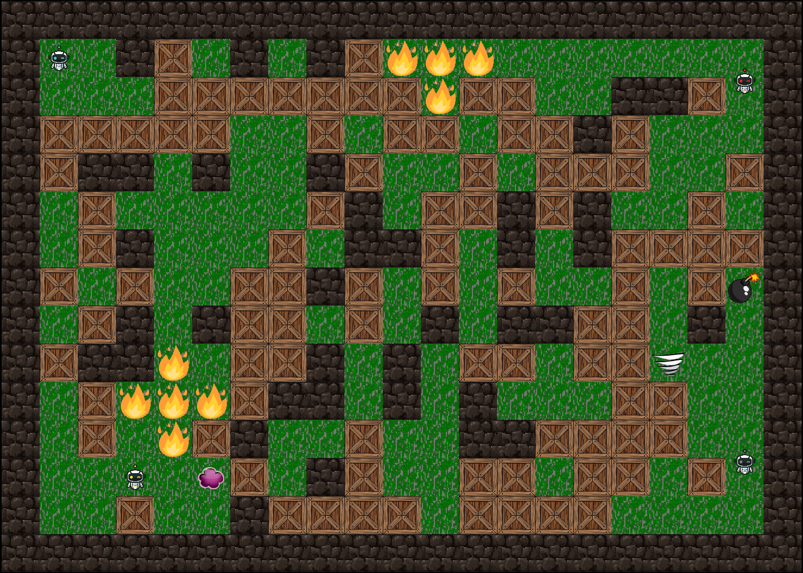

# BomBot

- Term Project for 15-112 (F21) at CMU
- BomBot Designed with PyGame

## Sprites

### Robot

- controlled by the user
- move in four directions: left, up, right, down
- place bomb

### Enemy

- behave similar to Robot but try to kill robot
- moving logics:
  - check safe or not
    - if dangerous: move to somewhere safe
  - find the shortest path to Robot
  - bomb Brick along the path
  - reach Robot and BomBot

### Brick

- destructible by Explosion

### Wall

- non-destructible by Explosion

### Bomb

- once detonated, create Explosion

### Explosion

- vertical and horizontal
- kill Robot and Enemy
- does not penetrate through Brick or Wall

## Controls

Below is a list containing all controls used in BomBot.

### Position

- Move Robot: Arrows

### Bomb

- Drop Bomb: Space

## Known Issues

### Board Generation:
  - by chance, large amount of emptiness in one location
  - by chance, robot is directly connected to other enemies without bombing bricks
  - by chance, large amount of bricks in one location
  - by chance, useless wall created (robot cannot enter space in between walls for shelter)

